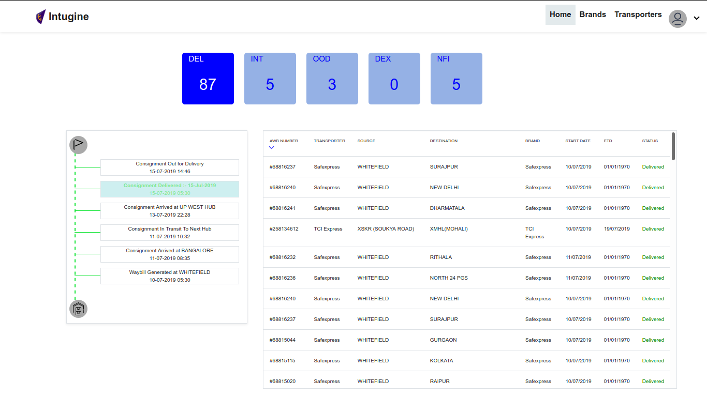
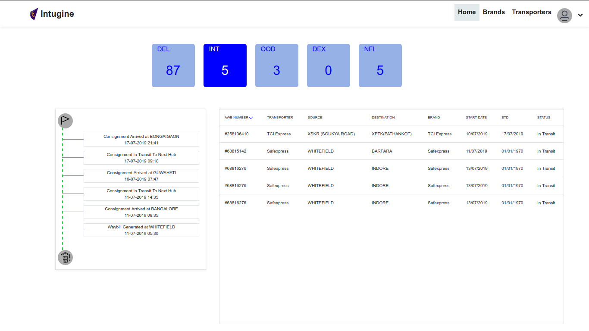
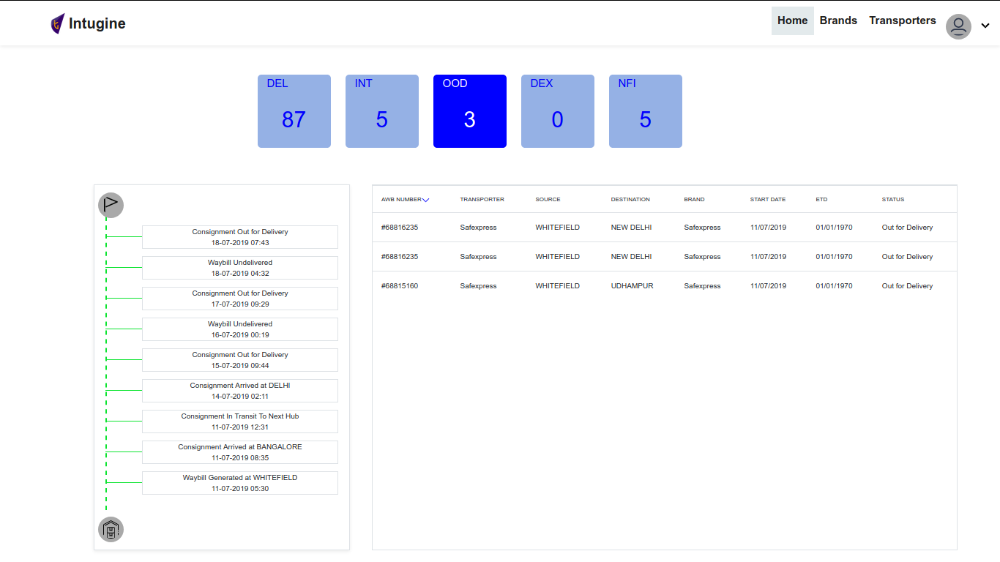
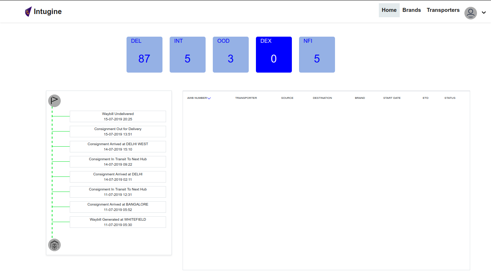
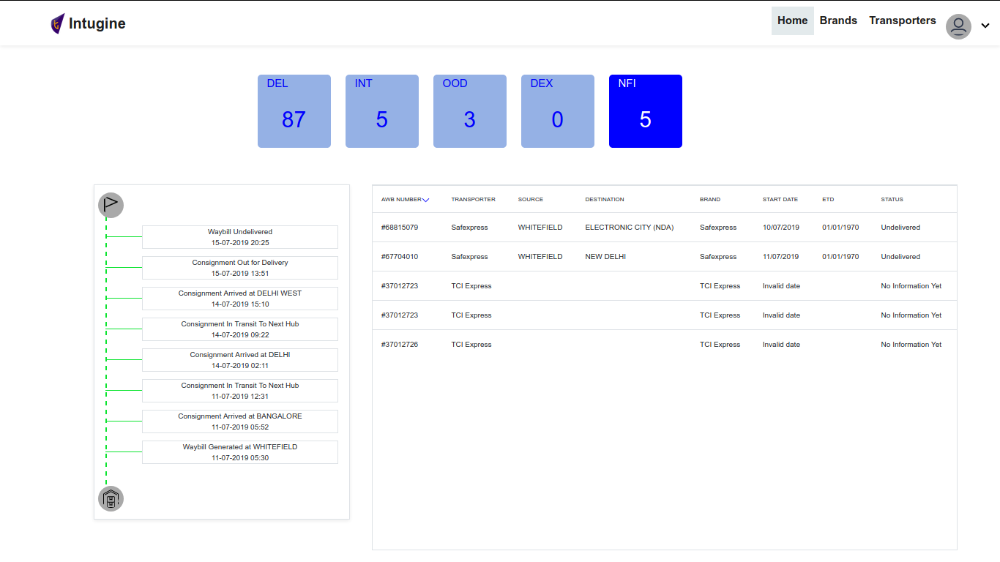

# MailModo--Coding-Task

## Project Description

The design is for a shipment dashboard where the various shipments are shown which are going through various vendors like FedEx, Bluedart etc.. The dashboard shows these shipments, give their current status by a timeline view, and there are some counters which shows the number of shipments which are in a particular state e.g. DEL (Delivered), INT (In Transit), OOD (Out for Delivery)

## Project Status

https://mailmodo-coding-task.herokuapp.com/

## Screenshots

  

  

  

  

  

